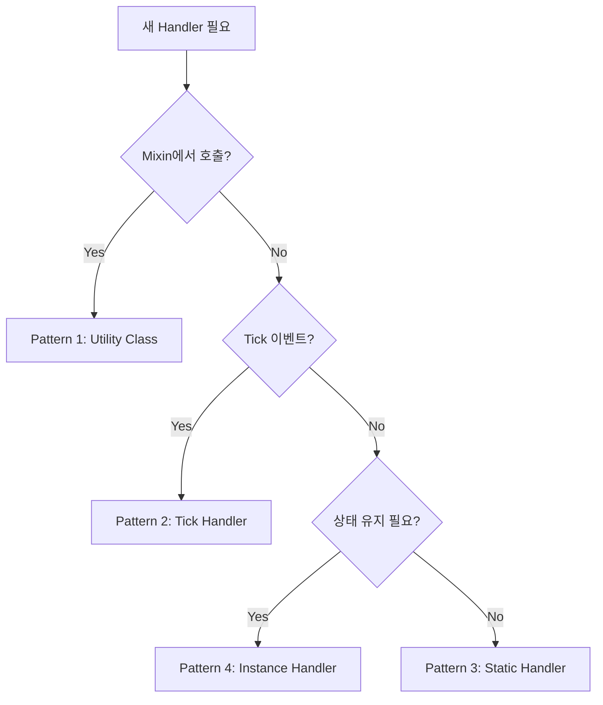

# Handler Patterns Guide

## Overview
MCOPT에서 사용하는 Handler 패턴들의 표준 가이드입니다. 새로운 Handler를 추가할 때 이 가이드를 참고하여 일관성을 유지하세요.

---

## Pattern 1: Rendering Handler (Utility Class)

**사용 시기**: Mixin에서 호출되는 비즈니스 로직 분리

**특징**:
- Stateless utility class
- Static methods only
- `private` 생성자
- `final` class

**예시**:
```java
/**
 * Handles entity culling logic for rendering optimization.
 */
public final class EntityCullingHandler {
    
    private EntityCullingHandler() {
        // Utility class
    }
    
    /**
     * Determines if an entity should be culled from rendering.
     */
    public static boolean shouldCullEntity(
            Entity entity,
            Camera camera,
            int cullingDistance) {
        
        if (!RenderingConfig.ENABLE_ENTITY_CULLING.get()) {
            return false;
        }
        
        // Business logic
        return decision;
    }
}
```

**현재 사용**:
- [EntityCullingHandler.java](file:///c:/Users/MW/Downloads/coding/MCOPTI/src/main/java/com/randomstrangerpassenger/mcopt/client/rendering/EntityCullingHandler.java)
- [ParticleOptimizationHandler.java](file:///c:/Users/MW/Downloads/coding/MCOPTI/src/main/java/com/randomstrangerpassenger/mcopt/client/rendering/ParticleOptimizationHandler.java)
- [RenderHandler.java](file:///c:/Users/MW/Downloads/coding/MCOPTI/src/main/java/com/randomstrangerpassenger/mcopt/client/rendering/RenderHandler.java)
- [XpOrbHandler.java](file:///c:/Users/MW/Downloads/coding/MCOPTI/src/main/java/com/randomstrangerpassenger/mcopt/server/entity/xp/XpOrbHandler.java)

---

## Pattern 2: Tick Handler (Base Class)

**사용 시기**: Server/Player tick 이벤트 처리

**특징**:
- 베이스 클래스 상속
- Config 캐싱 자동화
- Template method pattern

**베이스 클래스**:
- [ConfigurableServerTickHandler](file:///c:/Users/MW/Downloads/coding/MCOPTI/src/main/java/com/randomstrangerpassenger/mcopt/common/ConfigurableServerTickHandler.java) - Server tick
- [ConfigurablePlayerTickHandler](file:///c:/Users/MW/Downloads/coding/MCOPTI/src/main/java/com/randomstrangerpassenger/mcopt/common/ConfigurablePlayerTickHandler.java) - Player tick

**예시**:
```java
@EventBusSubscriber(modid = MCOPT.MOD_ID)
public class MyServerHandler extends ConfigurableServerTickHandler {
    
    public MyServerHandler() {
        super(MCOPTConfig.ENABLE_MY_FEATURE);
    }
    
    @Override
    protected void onConfiguredServerTick(ServerTickEvent.Post event) {
        // Your server-side logic here
        // Config check already done by base class
    }
}
```

**장점**:
- Config 캐싱 자동화
- 보일러플레이트 감소
- 일관된 활성화 체크

---

## Pattern 3: Event Handler (Static Methods)

**사용 시기**: 특정 게임 이벤트 처리 (static 방식)

**특징**:
- `@EventBusSubscriber` 사용
- Static methods with `@SubscribeEvent`
- Config 체크 직접 수행
- `final` class (대부분)

**예시**:
```java
/**
 * Handles fishing rod stability fixes.
 */
@EventBusSubscriber(modid = MCOPT.MOD_ID)
public final class FishingRodFixHandler {
    
    private FishingRodFixHandler() {
        // Prevent instantiation
    }
    
    @SubscribeEvent
    public static void onPlayerTick(PlayerTickEvent.Post event) {
        // Config check
        if (!GameplayConfig.ENABLE_FISHING_ROD_FIX.get()) {
            return;
        }
        
        // Null/safety checks
        if (!(event.getEntity() instanceof ServerPlayer player)) {
            return;
        }
        
        // Business logic
        // ...
    }
}
```

**현재 사용**:
- [FishingRodFixHandler.java](file:///c:/Users/MW/Downloads/coding/MCOPTI/src/main/java/com/randomstrangerpassenger/mcopt/server/entity/fishing/FishingRodFixHandler.java)
- [HealthStabilityHandler.java](file:///c:/Users/MW/Downloads/coding/MCOPTI/src/main/java/com/randomstrangerpassenger/mcopt/server/entity/health/HealthStabilityHandler.java)
- [BeeFixHandler.java](file:///c:/Users/MW/Downloads/coding/MCOPTI/src/main/java/com/randomstrangerpassenger/mcopt/server/entity/bee/BeeFixHandler.java)
- [PortalRedirectionHandler.java](file:///c:/Users/MW/Downloads/coding/MCOPTI/src/main/java/com/randomstrangerpassenger/mcopt/server/entity/portal/PortalRedirectionHandler.java)

---

## Pattern 4: Event Handler (Instance Methods)

**사용 시기**: 상태 유지가 필요한 이벤트 처리

**특징**:
- Instance fields for state
- Instance methods with `@SubscribeEvent`
- MCOPT.java에서 수동 등록
- Feature toggle로 조건부 등록

**예시**:
```java
/**
 * Prevents accidental grief actions.
 */
public class ActionGuardHandler {
    
    // Instance state
    private final Map<UUID, Long> lastWarningTick = new ConcurrentHashMap<>();
    
    @SubscribeEvent
    public void onAttackEntity(AttackEntityEvent event) {
        // Config check
        if (!FeatureToggles.isEnabled(FeatureKey.ACTION_GUARD)) {
            return;
        }
        
        // Use instance state
        UUID id = player.getUUID();
        long lastTick = lastWarningTick.getOrDefault(id, -COOLDOWN);
        // ...
    }
}
```

**MCOPT.java 등록**:
```java
if (FeatureToggles.isEnabled(FeatureKey.ACTION_GUARD)) {
    NeoForge.EVENT_BUS.register(new ActionGuardHandler());
}
```

**현재 사용**:
- [ActionGuardHandler.java](file:///c:/Users/MW/Downloads/coding/MCOPTI/src/main/java/com/randomstrangerpassenger/mcopt/safety/ActionGuardHandler.java)
- [ResourceCleanupHandler.java](file:///c:/Users/MW/Downloads/coding/MCOPTI/src/main/java/com/randomstrangerpassenger/mcopt/safety/ResourceCleanupHandler.java)

---

## 패턴 선택 가이드



---

## 체크리스트

새 Handler 작성 시 확인사항:

### 공통
- [ ] Javadoc 작성 (목적, 기능 설명)
- [ ] Config 체크 수행
- [ ] Null/safety 체크 수행
- [ ] `*Handler` 네이밍 사용
- [ ] MCOPT.LOGGER 사용 (debug/info)

### Pattern별
**Pattern 1 (Utility)**:
- [ ] `final class`
- [ ] `private` 생성자
- [ ] Static methods만 사용

**Pattern 2 (Tick)**:
- [ ] 적절한 베이스 클래스 상속
- [ ] `@EventBusSubscriber` 추가
- [ ] 생성자에서 config 전달

**Pattern 3 (Static Event)**:
- [ ] `@EventBusSubscriber` 추가
- [ ] `final class` (권장)
- [ ] `private` 생성자
- [ ] Static methods + `@SubscribeEvent`

**Pattern 4 (Instance Event)**:
- [ ] MCOPT.java에서 등록
- [ ] Feature toggle 체크 (조건부 등록)
- [ ] Instance fields 문서화

---

## Anti-Patterns

### ❌ Config를 매 틱마다 체크
```java
// BAD
@SubscribeEvent
public void onTick(ServerTickEvent.Post event) {
    // Repeated .get() call every tick
    if (interval != MyConfig.INTERVAL.get()) {
        interval = MyConfig.INTERVAL.get();
    }
}
```

### ✅ Config 캐싱 사용
```java
// GOOD - Use base class
public class MyHandler extends ConfigurableServerTickHandler {
    // Auto-cached by base class
}

// GOOD - Manual cache
private static int cachedInterval = MyConfig.INTERVAL.get();

public static void refreshConfigCache() {
    cachedInterval = MyConfig.INTERVAL.get();
}
```

### ❌ Mixin에 비즈니스 로직
```java
// BAD
@Mixin(EntityRenderDispatcher.class)
public class SomeMixin {
    @Inject(method = "render", ...)
    private void hook(...) {
        // 40+ lines of complex logic here
        Vec3 pos = ...;
        double distance = ...;
        // ...
    }
}
```

### ✅ Handler로 분리
```java
// GOOD
@Mixin(EntityRenderDispatcher.class)
public class SomeMixin {
    @Inject(method = "render", ...)
    private void hook(...) {
        if (SomeHandler.shouldCull(entity, camera)) {
            ci.cancel();
        }
    }
}

// Separate handler
public final class SomeHandler {
    public static boolean shouldCull(...) {
        // Business logic here
    }
}
```

---

## 참고

- [EventBusRegistration.md](file:///c:/Users/MW/Downloads/coding/MCOPTI/docs/EventBusRegistration.md) - 이벤트 버스 등록 가이드
- [Phase 3.1 Walkthrough](file:///C:/Users/MW/.gemini/antigravity/brain/02661ce4-967b-4f22-89ae-dbd38994a073/walkthrough.md) - Mixin/Handler 분리 사례
